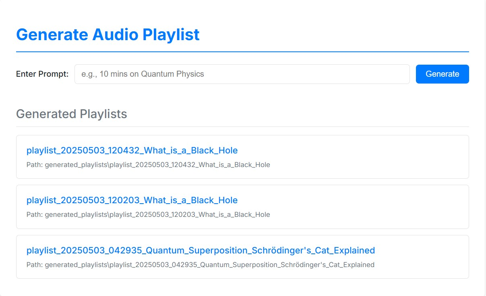

# Audio Playlist Generator

This project generates personalized audio playlists based on user prompts. It uses AI models to analyze prompts, generate scripts, and convert them into audio files.

## How to Run

1.  Ensure you have all the required dependencies installed.
2.  Run the main file `app.py`:
    ```bash
    python app.py
    ```
3.  Once the application starts, a weblink will be displayed in the console (e.g., `http://127.0.0.1:5000`).
4.  Open the link in your browser to access the UI and interact with the model.

## Features

-   Generate audio playlists based on user prompts.
-   View and listen to generated audio segments.
-   Simple and intuitive web-based interface.

## Example Prompt to the Agent

Here's an example of a prompt you could provide to the application:

> I have 15 mins to reach home. I want to learn about black holes

## Output Audios for the Example Prompt

Based on the example prompt above, the application would generate a series of audio files designed to fit the 15-minute timeframe, covering the topic of black holes.

You can listen to example output segments below (requires clicking the link - direct playback in the README is not supported by standard Markdown):

*   [Listen to Segment 1: What is a Black Hole](./example_audio/segment_1_What_is_a_Black_Hole.mp3)
*   [Listen to Segment 2: The Life Cycle of Stars and Black Hole Formation](./example_audio/segment_2_The_Life_Cycle_of_Stars_and_Black_Hole_Formation.mp3)
*   [Listen to Segment 3: Exploring Black Hole Effects Gravity and Time](./example_audio/segment_3_Exploring_Black_Hole_Effects_Gravity_and_Time.mp3)


*(Note: These are example files. The actual number, names, and content of the audio files generated by the application will vary based on the AI's processing of the prompt and the requested duration. You can listen to newly generated files directly through the web interface or by accessing the `generated_playlists` folder after running a prompt.)*

## Folder Structure

-   `app.py`: Main application file.
-   `model_wt_audio_2.py`: Contains the core logic for processing user prompts and generating audio.
-   `templates/`: HTML templates for the web interface.
-   `static/`: CSS styles for the web interface.
-   `generated_playlists/`: Directory where generated audio playlists are stored (created automatically).
-   `example_audio/`: Contains example audio output files for demonstration.
-   `.env`: Environment variables for API keys.

## Requirements

-   Python 3.7 or higher
-   Flask
-   Required API keys for Google Generative AI, Tavily, and ElevenLabs (set in `.env` file).

## Notes

-   Ensure the `.env` file is properly configured with valid API keys before running the application.
-   The `generated_playlists` directory will be created automatically if it doesn't exist when the first playlist is generated.
